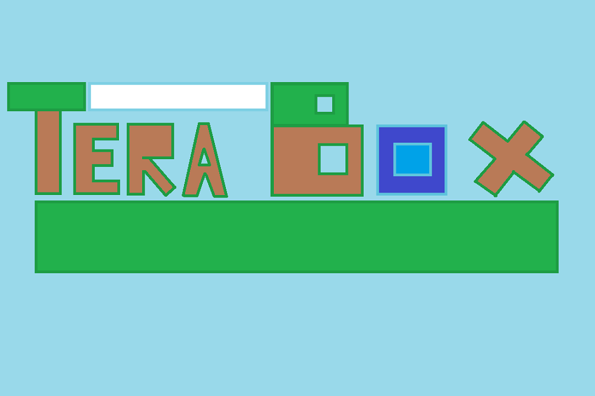

# **Video Game: TerraBox**

### **By: Valentin Dumitru UO277867 & Nuria Inchaurrandieta Fernández UO277418**
## Video

> Click on the image to watch the video
---

## **1. Features**

**TerraBox** is a sandbox survival game with a mostly original and fully customized pixel art style.  
All visual assets were created by us, except the main player sprite and the zombie.

### **Core Mechanics**
- **Mining**, **chopping trees**, **attacking** with sword and bow.
- **Construction**: place blocks within range.

### **Blocks**
- **Wood Block**: obtained by chopping trees.  
- **Dirt Block**: from breaking dirt or grass-covered dirt.  
- **Stone Block**: from breaking stone.  
- **Bedrock**: indestructible and unobtainable.  
- **Tree Leaves**: cannot be obtained; breaking them gives nothing.

### **Enemies**
- **Zombie**:  
  - Chases you and jumps when you try to leap over it.  
- **Slime**:  
  - Hops toward you.  
  - Splits into two smaller slimes when killed.

### **Combat & UI**
- Both enemies and player receive **knockback** on hit.  
- Health is shown above heads:  
  - **Color-coded**: green (full) → red (low).  
- The UI has a **health bar** with visual slots.  
- **Damage numbers** appear near the target in **orange**.  
- Breaking blocks shows a **cracking animation**.  
- Hovering over a block **highlights it**.  
- Player **can’t break/place blocks outside range**.

---

## **2. How to Play**

- **Move**: `W`, `A`, `S`, `D`  
- **Select inventory item**: `1`, `2`, `3`, ...  
- **Mine blocks**:  
  - Equip pickaxe  
  - Hover cursor over block  
  - Hold **left click**  
- **Place blocks**:  
  - Equip block  
  - Hover cursor over empty space  
  - Click **left click**  
- **Attack**:  
  - Equip sword or bow  
  - Click **left click**

---

## **3. How to Win**

You don’t. **TerraBox** is pure **sandbox survival**.  
There’s no time limit, no goal.  
The only limit is your **imagination**.  
It’s about **fun, exploration, and creativity**.
